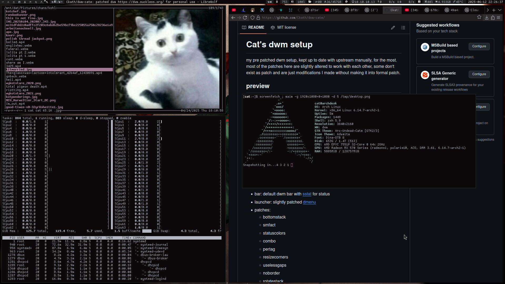

# Cat's dwm setup
my pre patched dwm setup, kept up to date with upstream manually, for the most. most of the patches here are slightly altered to work with each other, some don't exist as patch and are just modifications I made without making it into  formal patch.

## preview

* bar: default dwm bar with [sstat](https://github.com/ckath/sstat) for status
* launcher: slightly patched [dmenu](https://github.com/ckath/dmenu-cate)
* patches:
    - bottomstack
    - smfact
    - statuscolors
    - combo
    - pertag
    - resizecorners
    - uselessgaps
    - noborder
    - rotatestack
    - xresourcescolors
	- r/ltile
	- attachbelow
	- wininforestartcache
    - possibly more
